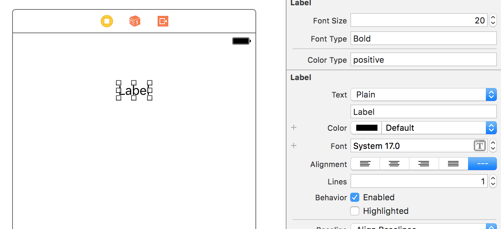

# KSUIKit - Enhanced UIKit for managing fonts and colours

iOS Storyboard (or Interface Builder) is an effective way of developing UI for the apps. Storyboard provides ways to change colour and fonts of UIComponents. Wow, thats really wonderful.

But since the font and colour of each component is hardcoded in storyboard, its really time consuming and a tedious job to change the font or colour schema through out the app.

Say about 50 screens of the app were build using the following

#### Font - Roboto
#### Color Schema - 

And now the font and colour schema changes as follows

#### Font - Palatino
#### Color Schema - 

Now you have to go revisit all the 50 screens on the Storyboard and change the font and colour of each component. This sounds really a shit job to be done. And also this isn't done. What if they want to revert back at a later point (Versioning helps but you are dealing with Storyboard, so forget about it).

You could make use of UIAppearance. For example you could change the font and color of a button using UIAppearance, but this will change all the buttons unless overridden (But for overridden button this again seems like the above problem). 

Wouldn't it be great if we could still set these properties in storyboard but changing the font or theme doesnt need to change in storyboard. Sound's real needy right. Yeah, so thats what this library does.

## Example
- Clone the repo
- run pod install from the Example directory
- Open KSUIKit.xcworkspace and run the app on Simulator or device

## Installation

KSUIKit is available through [CocoaPods](http://cocoapods.org). To install
it, simply add the following line to your Podfile:

```ruby
pod "KSUIKit"
```

## Usage

Configure the colours and fonts you would be using in the app in the appdelegate as shown in below example
```swift
KSUITheme.appearance().fonts = ["Regular": "Roboto-Light",
                                "Italic": "Palatino-Italic",
                                "Bold": "Palatino-Bold",
                                "BoldItalic": "Roboto-BoldItalic"]
        
KSUITheme.appearance().colors = ["positive" : UIColor(rgb: 0x387ef5),
                                 "balanced" : UIColor(rgb: 0x33cd5f),
                                 "energized" : UIColor(rgb: 0xffc900),
                                 "assertive" : UIColor(rgb: 0xef473a),
                                 "white" : UIColor.white]
```

In Storyboard, select the component (label for example) and in the **Identity inspector** set the **custom class** to **KSUILabel** and **module** to **KSUIKit**

Now in the **Attribute Inspector** you should find new attributes to be configured. Configure them with the keys you mentioned in the **KSUITheme appearance** defined in app delegate. (Find example in below image).



You will find that the changes are not reflecting in the StoryBoard, this is because **Theme appearance is set in the app delegate** and would be available only while the app is running. 

*Figuring out a way to make this Theme appearance available for story board. Will update the library once a better way is available.*

## Documentation

#### KSUIView
- **bgColorType: String?**
</br>nil value will set the one picked from color picker in Storyboard
#### KSUILabel
- **fontType: String?**
</br>nil value will set the one picked from font picker in Storyboard

- **fontSize: CGFloat** default = 16
</br>will not effect if **fontType** is nil

- **colorType: String?**
</br>nil value will set the one picked from color picker in Storyboard

#### KSUIButton
- **fontType: String?**
</br>nil value will set the one picked from font picker in Storyboard

- **fontSize: CGFloat** default = 16
</br>will not effect if **fontType** is nil

- **colorType: String?**
</br>nil value will set the one picked from color picker in Storyboard

- **bgColorType: String?**
</br>nil value will set UIColor.clear for backgroundColor

- **borderColorType: String?**
</br>nil value will set UIColor.clear for borderColor

- **borderWidth: CGFloat** default = 0

- **cornerRadius: CGFloat** default = 0

#### KSUITextField
- **fontType: String?**
</br>nil value will set the one picked from font picker in Storyboard

- **fontSize: CGFloat** default = 16
</br>will not effect if **fontType** is nil

- **colorType: String?**
</br>nil value will set the one picked from color picker in Storyboard

- **borderColorType: String?**
</br>nil value will set UIColor.clear for borderColor

- **borderWidth: CGFloat** default = 0

- **cornerRadius: CGFloat** default = 0

#### KSUISegmentedControl

- **fontSize: CGFloat** default = 16
</br>will not effect if **fontType** is nil

- **normalFontType: String?**
</br>nil value will set system font with size **fontSize**

- **highlightedFontType: String?**
</br>nil value will take **normalFontType**

- **selectedFontType: String?**
</br>nil value will take **normalFontType**

- **disabledFontType: String?**
</br>nil value will take **normalFontType**


## Author
srinivasan.munna@gmail.com

## License
KSUIKit is available under the MIT license. See the LICENSE file for more info.
